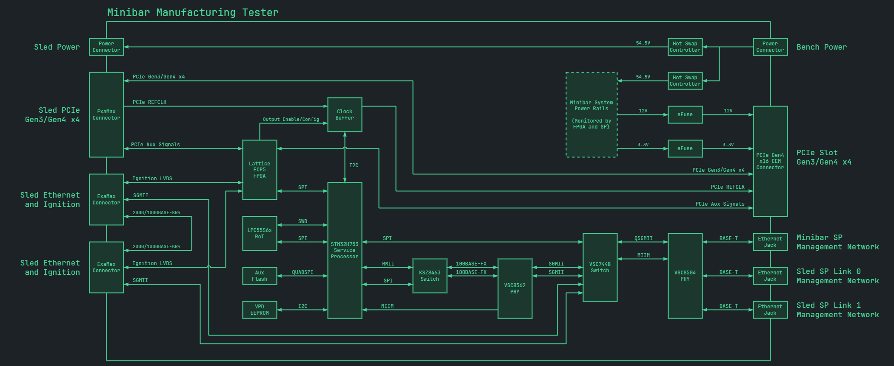

= oxide-mermaid-theme

ifdef::env-github[]
:mermaid: source, mermaid
endif::[]
ifndef::env-github[]
:mermaid: mermaid
endif::[]

A Mermaid theme built from Oxide's dark-green terminal aesthetic.

Inspiration comes from this cool looking diagram in
https://rfd.shared.oxide.computer/rfd/0363[RFD 0363]:

[link=https://rfd.shared.oxide.computer/rfd/image/363/figures/top_level_block_diagram.png]

== Mermaid demo

=== Flowchart

[{mermaid}]
----
---
title: Minibar Manufacturing Tester
include::oxide-mermaid-theme.yml[]
---
include::Minibar Manufacturing Tester.mmd[]
----

=== Sequence diagram

From https://rfd.shared.oxide.computer/rfd/0373#_target_driven[RFD 0373].

[{mermaid}]
----
---
include::oxide-mermaid-theme.yml[]
---
include::Event-driven activation with target-driven updates.mmd[]
----