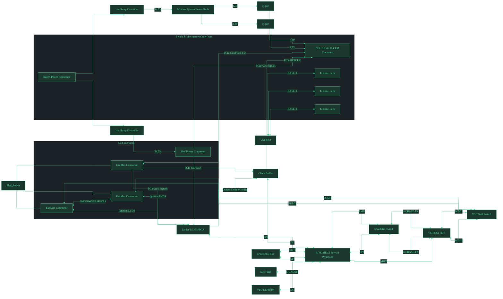
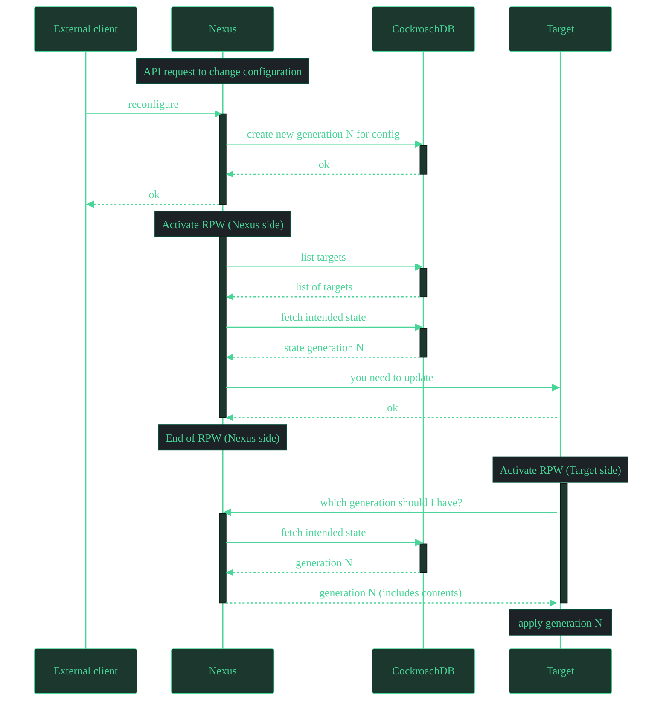

# oxide-mermaid-theme

A Mermaid theme built from Oxide's dark-green terminal aesthetic.

Inspiration comes from this cool looking diagram in [RFD 0363](https://rfd.shared.oxide.computer/rfd/0363):

## Mermaid demo

### Flowchart

Minibar Manufacturing Tester.

### Sequence diagram

From [RFD 0373](https://rfd.shared.oxide.computer/rfd/0373#_target_driven).

